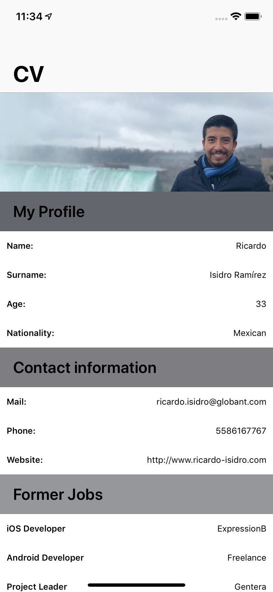
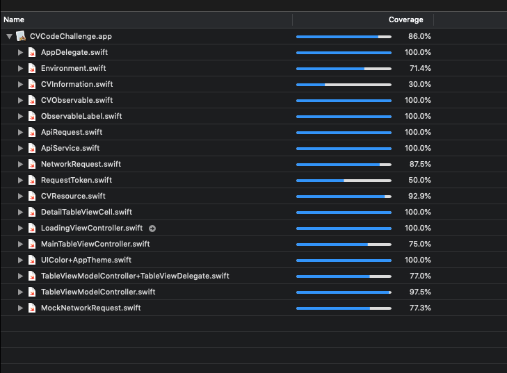

# My Globant CV code challenge

 

**What the project does?**

This project consist in an expandable/collapsable TableView showing data about my resume. It was buided considering:

- A MVVM architecture using Observables.
- Good project structure
- Clear separation of concerns
- Unit and UI Test

**How it works?**

The app works by fetching the CV data from a JSON file using an URLRequest. After that, information is grouped in some TableView sections.
You can hide/show more information, just clicking in each section.
There are UI and Unit Test on the project. 
The Unit Test is able to validate if a call to the JSON information have a right response (200 OK), if CVInformation struct is completed correctly, ann if API Service can return an OK response correctly, and so on.
On the other hand, the UI Tests are able to validate if the expand/collapse user interactions on the TableView are working properly.

**How the users can get started with the project?**

Just clone the project and open it with XCode 10.2.

**Building this project**

Additional libraries are not needed to build this project. Just download it and build it with XCode 10.2.

**Screenshots**

**Test Coverage**

